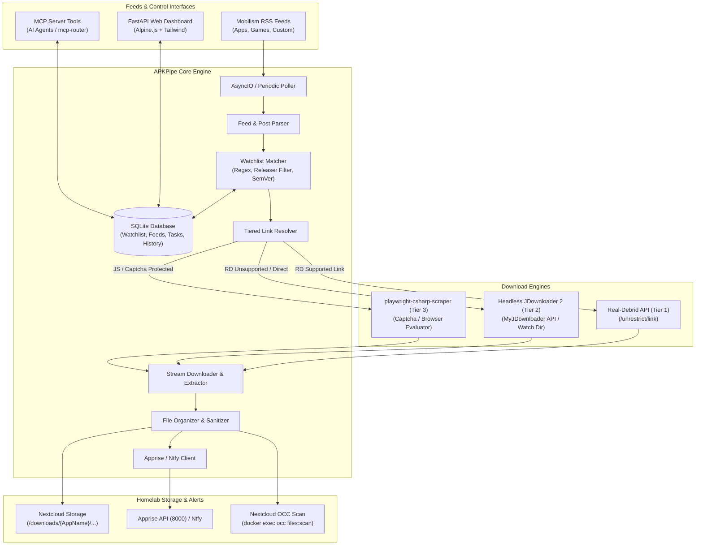

<div align="center">

# 📦 APKPipe

**Automated APK & RSS release pipeline pairing Real-Debrid un-restricting, headless JDownloader fallback, Nextcloud storage ingestion, Apprise alerts, Web Dashboard, and native MCP Server.**

[](https://github.com/spelech/apkpipe/actions/workflows/ci.yml)
[](https://github.com/spelech/apkpipe)
[](https://www.python.org/downloads/)
[](https://github.com/spelech/apkpipe/pkgs/container/apkpipe)
[](LICENSE)

</div>

---

## 📖 Table of Contents

- [Overview](#-overview)
- [Architecture](#-architecture)
- [Key Features](#-key-features)
- [Quick Start](#-quick-start)
  - [Docker Compose Deployment](#docker-compose-deployment)
  - [Environment Variables](#environment-variables)
- [Download Engines & Resolvers](#-download-engines--resolvers)
  - [Tier 1: Real-Debrid API](#tier-1-real-debrid-api)
  - [Tier 2: Headless JDownloader 2](#tier-2-headless-jdownloader-2)
  - [Tier 3: Playwright Scraper Client](#tier-3-playwright-scraper-client)
- [Homelab Integrations](#-homelab-integrations)
  - [Nextcloud Storage & OCC Auto-Scanning](#nextcloud-storage--occ-auto-scanning)
  - [Apprise & Ntfy Push Notifications](#apprise--ntfy-push-notifications)
- [Model Context Protocol (MCP) Server](#-model-context-protocol-mcp-server)
  - [Available MCP Tools](#available-mcp-tools)
  - [AI Agent Configuration](#ai-agent-configuration)
- [REST API Reference](#-rest-api-reference)
- [Web Dashboard UI](#-web-dashboard-ui)
- [Development & Testing](#-development--testing)
- [License](#-license)

---

## 🌟 Overview

Maintaining an up-to-date, self-hosted Android application library on Nextcloud or local network storage traditionally requires tedious manual labor: browsing release forums (such as Mobilism), checking version strings, bypassing multi-hoster mirror links (Rapidgator, Uploady, DropGalaxy), unzipping archives, renaming APKs, moving files to proper directories, triggering Nextcloud file indexing, and tracking release history.

**APKPipe** completely automates this lifecycle end-to-end:
1. **Monitors RSS feeds** periodically for new application releases.
2. **Matches releases against a customizable Watchlist** with regex patterns, releaser whitelists (`[Balatan]`, `[derrin]`, `[RockMODS]`), and SemVer version gating.
3. **Resolves download links** via a 3-tier strategy (Real-Debrid API $\rightarrow$ JDownloader 2 $\rightarrow$ Playwright Scraper).
4. **Downloads and unpacks archives** (`.zip`, `.rar`, `.7z`, `.tar`) to extract APK binaries.
5. **Organizes binaries** into clean, standardized directory structures (`{DOWNLOAD_DIR}/{AppName}/{AppName} v{Version} [{Releaser}].apk`).
6. **Dispatches Nextcloud OCC scan commands** (`occ files:scan`) so files immediately appear in your mobile Nextcloud app.
7. **Pushes rich status alerts** to Discord, Telegram, Pushover, or Ntfy via Apprise.
8. **Exposes native MCP Server tools and a Web Dashboard** for human management and autonomous AI agent operations.

---

## 📐 Architecture



---

## ✨ Key Features

- 🔄 **Autonomous Feed Ingestion**: Periodic polling of multiple RSS / ATOM feed sources with deduplication.
- 🎯 **Fine-Grained Matcher**: Target specific apps by name or regex, require minimum version thresholds, and filter by trusted releaser tags.
- ⚡ **Multi-Tier Link Unrestricting**:
  - **Tier 1 (Real-Debrid)**: Direct high-speed API un-restricting for 50+ filehosters.
  - **Tier 2 (JDownloader 2)**: Headless MyJDownloader cloud API or local folder linkgrabber.
  - **Tier 3 (Playwright Scraper)**: Headless browser scraper fallback for dynamic landing pages.
- 📦 **Automated Archive Extraction**: Transparently handles `.zip`, `.rar`, `.7z`, and `.tar.gz` archives, extracting nested `.apk` binaries.
- 📂 **Nextcloud OCC Integration**: Seamless placement into Nextcloud user directories with automated `occ files:scan` invocation.
- 🔔 **Multi-Channel Homelab Notifications**: Push notifications via Apprise API and Ntfy with release metadata, file sizes, and download duration.
- 🤖 **Native Model Context Protocol (MCP)**: 8 built-in tools compatible with Claude Desktop, Cursor, and `mcp-router`.
- 💻 **Responsive Web Dashboard**: Clean dark/light theme built with Alpine.js and Tailwind CSS.

---

## 🚀 Quick Start

### Docker Compose Deployment

The recommended way to run APKPipe in production is using Docker Compose.

1. Create a `docker-compose.yaml` file:

```yaml
services:
  apkpipe:
    image: ghcr.io/spelech/apkpipe:latest
    container_name: apkpipe
    restart: unless-stopped
    ports:
      - "8429:8000"
    environment:
      - APKPIPE_APP_NAME=APKPipe
      - APKPIPE_HOST=0.0.0.0
      - APKPIPE_PORT=8000
      - APKPIPE_DATABASE_URL=sqlite+aiosqlite:////data/apkpipe.db
      - APKPIPE_DOWNLOAD_DIR=/downloads
      - APKPIPE_STAGING_DIR=/data/staging
      - APKPIPE_POLL_INTERVAL_SECONDS=900
      - APKPIPE_REAL_DEBRID_API_TOKEN=your_real_debrid_token_here
      - APKPIPE_NEXTCLOUD_URL=http://nextcloud:80
      - APKPIPE_NEXTCLOUD_OCC_COMMAND=docker exec nextcloud-aio-nextcloud sudo -u www-data php /var/www/html/occ files:scan --path="{path}"
      - APKPIPE_APPRISE_URL=http://apprise:8000/notify/apprise
      - APKPIPE_NTFY_TOPIC=apkpipe-alerts
    volumes:
      - ./data:/data
      - /drives/storage/Nextcloud/APKs:/downloads
      - /var/run/docker.sock:/var/run/docker.sock:ro
    labels:
      - "caddy=apk.wileyriley.com"
      - "caddy.reverse_proxy={{upstreams 8000}}"
      - "caddy.import=tinyauth"
    healthcheck:
      test: ["CMD", "curl", "-f", "http://localhost:8000/health"]
      interval: 30s
      timeout: 5s
      retries: 3
      start_period: 15s
    networks:
      - default
      - caddy

networks:
  default:
    name: apkpipe_net
  caddy:
    external: true
```

2. Launch the stack:

```bash
docker compose up -d
```

3. Open your browser to `http://localhost:8429` (or `https://apk.wileyriley.com` if routed via Caddy).

---

### Environment Variables

| Variable | Default | Description |
| :--- | :--- | :--- |
| `APKPIPE_DATABASE_URL` | `sqlite+aiosqlite:///apkpipe.db` | Async SQLAlchemy SQLite database connection string |
| `APKPIPE_DOWNLOAD_DIR` | `/downloads` | Base target path for organized APK library |
| `APKPIPE_STAGING_DIR` | `/data/staging` | Temporary scratch folder for active streams & extraction |
| `APKPIPE_POLL_INTERVAL_SECONDS` | `900` | Feed poller frequency in seconds (default: 15 mins) |
| `APKPIPE_REAL_DEBRID_API_TOKEN` | `""` | Real-Debrid API Token (from real-debrid.com/apitoken) |
| `APKPIPE_JDOWNLOADER_EMAIL` | `""` | MyJDownloader Account Email (optional Tier 2) |
| `APKPIPE_JDOWNLOADER_PASSWORD` | `""` | MyJDownloader Account Password |
| `APKPIPE_JDOWNLOADER_DEVICE_NAME` | `""` | MyJDownloader Target Device Name |
| `APKPIPE_JDOWNLOADER_WATCH_DIR` | `""` | Watch directory for headless JDownloader `.crawljob` files |
| `APKPIPE_SCRAPER_URL` | `http://scraper:8080` | URL for Playwright headless scraper service |
| `APKPIPE_NEXTCLOUD_URL` | `""` | Nextcloud server base URL |
| `APKPIPE_NEXTCLOUD_TOKEN` | `""` | Nextcloud WebDAV / API authentication token |
| `APKPIPE_NEXTCLOUD_OCC_COMMAND` | `""` | OCC scan command template (`{path}` is substituted) |
| `APKPIPE_APPRISE_URL` | `""` | Apprise API notification endpoint |
| `APKPIPE_NTFY_TOPIC` | `""` | Ntfy topic identifier for push notifications |

---

## ⚡ Download Engines & Resolvers

### Tier 1: Real-Debrid API
APKPipe natively authenticates with Real-Debrid's REST API `/unrestrict/link`. When a forum post contains mirrors (Rapidgator, Uploady, DropGalaxy, Mega, Katfile, etc.), Real-Debrid un-restricts the link into a high-speed, direct CDN URL.

**To configure Real-Debrid:**
1. Generate an API token at [real-debrid.com/apitoken](https://real-debrid.com/apitoken).
2. Set `APKPIPE_REAL_DEBRID_API_TOKEN=your_token` in your environment or via the Web UI Settings tab.

### Tier 2: Headless JDownloader 2
For hosters not supported by Real-Debrid or requiring specialized decrypters, APKPipe connects to headless JDownloader 2 instances via:
- **MyJDownloader Cloud API**: Submits download packages directly to your connected device.
- **Linkgrabber Watch Directory**: Drops `.crawljob` instructions into a shared folder.

### Tier 3: Playwright Scraper Client
When download landing pages are protected by JavaScript redirection or cloud protection, APKPipe dispatches page evaluation tasks to `playwright-csharp-scraper` (`http://scraper:8080`), which evaluates the DOM and extracts final direct download mirrors.

---

## 🔗 Homelab Integrations

### Nextcloud Storage & OCC Auto-Scanning

APKPipe formats and places files into your Nextcloud storage directory:
```
/downloads/
├── Spotify/
│   └── Spotify v8.9.18.534 [Balatan].apk
└── Nova Launcher/
    └── Nova Launcher v8.0.18 [Prime].apk
```

To inform Nextcloud of newly downloaded files without waiting for Nextcloud background jobs, APKPipe executes `occ files:scan`:
- **Docker Exec (Recommended)**: Pass Docker socket `/var/run/docker.sock` and set:
  ```env
  APKPIPE_NEXTCLOUD_OCC_COMMAND=docker exec nextcloud-aio-nextcloud sudo -u www-data php /var/www/html/occ files:scan --path="{path}"
  ```
- **CLI / Host Exec**: Direct command invocation if APKPipe runs directly on the host.

### Apprise & Ntfy Push Notifications

APKPipe emits structured event notifications on:
- 🔍 `feed_matched`: Release discovered matching a watchlist rule.
- ⬇️ `download_started`: Unrestricting link and initiating streaming download.
- ✅ `download_completed`: Archive extracted, file placed, OCC scan complete.
- ❌ `download_failed`: Error details and failure cause.

**Supported notification endpoints:**
- Apprise API: `http://apprise:8000/notify/apprise`
- Ntfy: `https://ntfy.sh/your-topic` or self-hosted Ntfy server.

---

## 🤖 Model Context Protocol (MCP) Server

APKPipe exposes a native **MCP 2026-07-28 (RC) Server** allowing AI assistants (Claude Desktop, Cursor, Antigravity `mcp-router`) to manage watchlists, inspect feeds, trigger polls, and download releases autonomously.

### Available MCP Tools

| Tool Name | Description | Key Parameters |
| :--- | :--- | :--- |
| `apkpipe__list_watchlist` | List monitored apps in the watchlist | `enabled_only`, `category`, `query` |
| `apkpipe__add_to_watchlist` | Add a new application to monitor | `app_name`, `package_name`, `title_regex`, `min_version`, `releaser_whitelist` |
| `apkpipe__remove_from_watchlist` | Disable or delete a watchlist entry | `watchlist_id`, `app_name`, `delete` |
| `apkpipe__search_feed` | Search cached or live RSS feeds | `query`, `is_regex`, `feed_url`, `limit` |
| `apkpipe__trigger_poll` | Manually run a feed poll cycle | `feed_id` (optional) |
| `apkpipe__download_url` | Manually submit a download link | `url`, `app_name`, `version`, `releaser` |
| `apkpipe__get_history` | Retrieve download history and audit logs | `limit`, `status`, `query` |
| `apkpipe__get_system_status` | Query health, database stats, storage usage | None |

### AI Agent Configuration

Add APKPipe to your `claude_desktop_config.json` or `mcp-router`:

```json
{
  "mcpServers": {
    "apkpipe": {
      "command": "python",
      "args": ["-m", "apkpipe.mcp.server"],
      "env": {
        "APKPIPE_DATABASE_URL": "sqlite+aiosqlite:////data/apkpipe.db",
        "APKPIPE_DOWNLOAD_DIR": "/downloads"
      }
    }
  }
}
```

Or connect via Streamable HTTP / SSE endpoint:
```
http://localhost:8429/mcp/sse
```

---

## 🌐 REST API Reference

The interactive OpenAPI / Swagger UI is available at `http://localhost:8429/docs`.

### Watchlist Endpoints
- `GET /api/watchlist` - List all watchlist items with optional search/filtering.
- `POST /api/watchlist` - Add a new application to watchlist.
- `GET /api/watchlist/{id}` - Retrieve a specific watchlist entry.
- `PUT /api/watchlist/{id}` - Update a watchlist item.
- `DELETE /api/watchlist/{id}` - Remove a watchlist entry.

### Feed Sources Endpoints
- `GET /api/feeds` - List all configured RSS feed sources.
- `POST /api/feeds` - Add a new RSS feed source.
- `POST /api/feeds/{id}/poll` - Trigger immediate polling of a specific feed.
- `POST /api/feeds/poll-all` - Trigger polling across all active feed sources.

### Downloads & History Endpoints
- `GET /api/downloads/queue` - List active tasks in the download pipeline.
- `GET /api/downloads/history` - List completed, failed, and historic downloads.
- `POST /api/downloads/manual` - Trigger an immediate download from direct/mirror URL.
- `POST /api/downloads/{task_id}/retry` - Retry a failed download task.

### System & Health Endpoints
- `GET /health` - System health check probe.
- `GET /api/settings` - Retrieve current application settings.
- `POST /api/settings` - Update runtime configuration.

---

## 🖥️ Web Dashboard UI

APKPipe includes a built-in Web UI accessible on port `8429`:
- **Dashboard (`/`)**: Overview metrics, active polling status, recent downloads, and system storage.
- **Watchlist (`/watchlist`)**: Add, edit, filter, and remove monitored applications.
- **Feed Sources (`/feeds`)**: Manage RSS URLs, polling frequencies, and trigger manual syncs.
- **History (`/history`)**: Audit trail of completed downloads, execution times, file sizes, and error traces.
- **Settings (`/settings`)**: Configure Real-Debrid tokens, Nextcloud OCC paths, and notification hooks.

---

## 🛠️ Development & Testing

### Local Setup

```bash
# Clone repository
git clone https://github.com/spelech/apkpipe.git
cd apkpipe

# Create and activate Python virtual environment
python3 -m venv .venv
source .venv/bin/activate

# Install development dependencies and editable package
pip install -r requirements-dev.txt
pip install -e .
```

### Running Test Suite & Coverage

Enforcing **≥ 80% line coverage**:

```bash
# Run pytest with coverage report
pytest --cov=src/apkpipe --cov-report=term-missing tests/
```

### Local Server Launch

```bash
# Start FastAPI application with live reloading
uvicorn apkpipe.main:app --host 0.0.0.0 --port 8000 --reload
```

---

## 📄 License

This project is licensed under the MIT License. See [LICENSE](LICENSE) for details.
