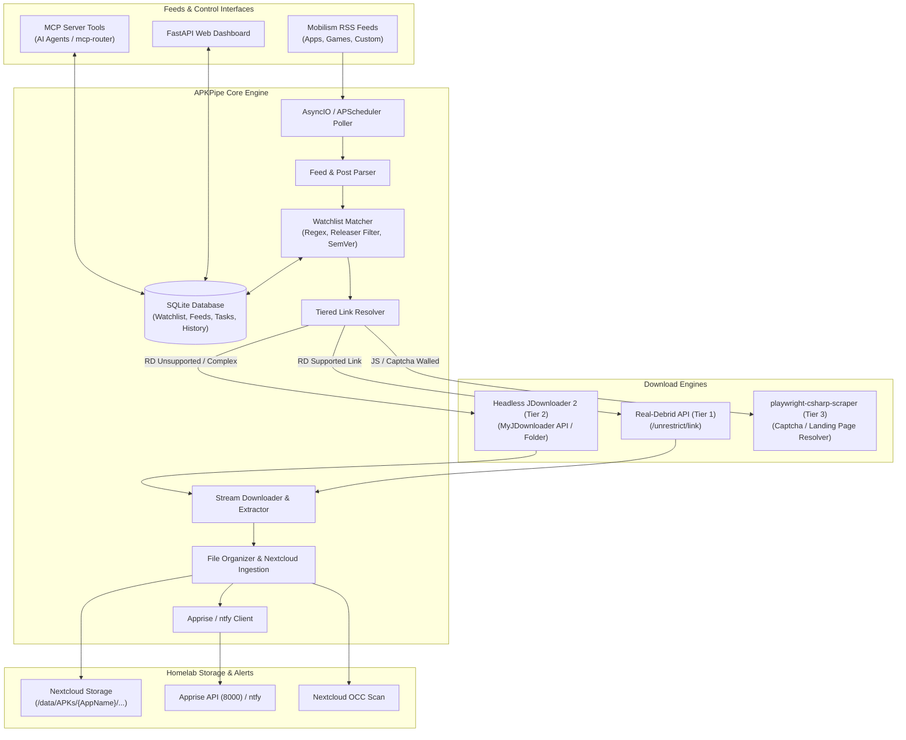

# APKPipe Design Specification

## 1. Overview & Problem Statement
Users maintaining a self-hosted media and Android app library (stored in Nextcloud or local homelab storage) need an automated, low-maintenance pipeline to monitor release feeds (e.g., Mobilism RSS), filter for specific applications and trusted high-quality releasers (e.g. `[Balatan]`, `[derrin]`, `[RockMODS]`), unrestrict mirror download links via Real-Debrid, fall back to headless JDownloader 2 or Playwright scraper for unsupported/captcha hosters, unpack and organize `.apk` files into structured Nextcloud directories, trigger Nextcloud indexing (`occ files:scan`), and notify the homelab notification server (`apprise`/`ntfy`).

Management should be seamless via both a modern **Web Dashboard** and a native **MCP Server** (integrated into `mcp-router`).

---

## 2. Architecture & Components

### Key Modules:
1. **Config & Models (`config.py`, `database/models.py`)**:
   - Pydantic Settings supporting ENV variables, `.env` file, and dynamic database-backed runtime settings.
   - SQLite tables: `watchlist_items`, `feed_sources`, `download_tasks`, `download_history`, `app_settings`.
2. **Feed Ingest & Watchlist Matcher (`feeds/parser.py`, `feeds/matcher.py`, `feeds/poller.py`)**:
   - Parses RSS XML / ATOM feeds.
   - Extracts App Title, Version, Releaser tag, Topic URL, Description.
   - Regex/fuzzy matching against watchlist items with releaser whitelist/blacklist and SemVer version checks.
3. **Topic Scraper & Mirror Extractor (`extractors/mobilism.py`, `extractors/scraper_client.py`)**:
   - Extracts download links from post body or topic HTML (`rapidgator.net`, `uploady.io`, `dropgalaxy.in`, `mega.nz`, `katfile.com`, `userupload.net`, `fastupload.io`, etc.).
   - Connects to `playwright-csharp-scraper` (`http://scraper:8080` or `10.0.0.10:8428`) when landing pages require browser evaluation.
4. **Tiered Resolution & Downloader (`resolvers/real_debrid.py`, `resolvers/jdownloader.py`, `downloader/engine.py`)**:
   - **Tier 1 (Real-Debrid)**: Resolves supported links via `/unrestrict/link`. Streams download chunks directly with resume capability.
   - **Tier 2 (JDownloader 2)**: Submits packages to JDownloader 2 instance via MyJDownloader API or Linkgrabber watched folder.
5. **Post-Processing & Ingestion (`downloader/archive.py`, `downloader/organizer.py`, `notifications/apprise.py`)**:
   - Unpacks `.zip` and `.rar` archives to extract `.apk` files.
   - Moves file to target path: `{DOWNLOAD_DIR}/{AppName}/{AppName} v{Version} [{Releaser}].apk`.
   - Dispatches `occ files:scan --path="..."` to Nextcloud container via Docker socket / SSH / API.
   - Posts status notification to Apprise endpoint.
6. **Web Dashboard & MCP Server (`web/`, `api/`, `mcp/server.py`)**:
   - Responsive modern UI (Dark/Light mode, Alpine.js + Tailwind CSS) with Live Feeds, Watchlist Management, Queue & History, Settings.
   - Native MCP Server exposing tools:
     - `apkpipe__list_watchlist`
     - `apkpipe__add_to_watchlist`
     - `apkpipe__remove_from_watchlist`
     - `apkpipe__search_feed`
     - `apkpipe__trigger_poll`
     - `apkpipe__download_url`
     - `apkpipe__get_history`
     - `apkpipe__get_system_status`

---

## 3. Testing & CI/CD Strategy
- **Coverage**: Pytest suite with `pytest-cov` enforcing **≥ 80% code coverage**.
- **GitHub Repository**: Public repository `spelech/apkpipe`.
- **Branching Strategy**: Atomic commits on feature branches, squashed merge to `main`.
- **GHCR Pipeline**: GitHub Actions workflow building and publishing multi-arch Docker image `ghcr.io/spelech/apkpipe:latest`.
