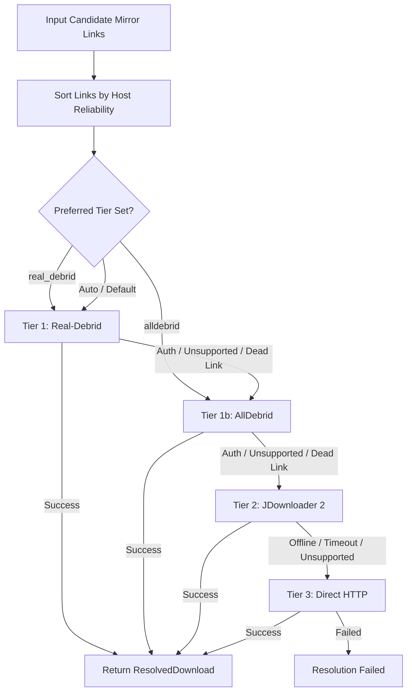

# Design Specification: AllDebrid Link Resolver Support with Peer Fallthrough

**Date:** 2026-08-23  
**Status:** Approved  
**Topic:** Link Resolution / Debrid Multihoster Integration  
**Scope:** Backend resolver module, resolution manager orchestration, application settings, FastAPI endpoints, React SPA settings & badge updates, MCP tools, and unit/integration tests.

---

## 1. Overview & Objective

Add full support for **AllDebrid** (`https://alldebrid.com`) as a peer debrid multihoster alongside **Real-Debrid**.
When resolving mirror links from APK forums/RSS feeds or manual download requests, the resolution pipeline must support seamless tier fallthrough:
- If Real-Debrid is unconfigured, missing an API key, or returns an authentication error (invalid/expired/unscoped key), or fails due to an unsupported/dead host, the pipeline automatically falls through to AllDebrid.
- If AllDebrid is unconfigured or encounters an invalid API key or unsupported host, it falls through to JDownloader 2 and Direct HTTP resolvers.
- Users can configure their AllDebrid API key via environment variables (`APKPIPE_ALLDEBRID_API_KEY`), database settings, the REST API, or the React Settings UI.

---

## 2. Architecture & Tier Hierarchy

### Resolver Priority Order (Default Chain)
1. `real_debrid` (Real-Debrid REST API)
2. `alldebrid` (AllDebrid v4 REST API)
3. `jdownloader` (JDownloader 2 MyJDownloader API)
4. `direct` (Direct HTTP HEAD/GET streamer)

---

## 3. AllDebrid Resolver Specification (`src/apkpipe/resolvers/all_debrid.py`)

### 3.1 Base Configuration & Client
- **Class**: `AllDebridResolver(BaseResolver)`
- **`name`**: `"alldebrid"`
- **`tier_name`**: `"alldebrid"`
- **Base URL**: `https://api.alldebrid.com/v4`
- **Agent Name**: `apkpipe` (sent in `agent` query parameter per AllDebrid API requirements)
- **API Key**: Loaded from `Settings.alldebrid_api_key` or explicit constructor parameter.
- **`is_configured`**: Returns `bool(self.api_key and self.api_key.strip())`.

### 3.2 Endpoints & Methods

#### `can_resolve(link: str) -> bool`
- Returns `False` if `not self.is_configured` or if link is empty / invalid scheme.
- Checks candidate hostname against local fast lookup table (`KNOWN_AD_HOSTERS`) and optionally cached remote host list from `/v4/hosts`.

#### `resolve(link: str, **kwargs) -> Optional[ResolvedDownload]`
- Endpoint: `GET https://api.alldebrid.com/v4/link/unlock?agent=apkpipe&apikey={api_key}&link={url_encoded_link}`
- Parses JSON response envelope `{ "status": "success" | "error", "data": { ... }, "error": { "code": "..." } }`.
- On Success (`status == "success"`):
  - Extracts `download_url = data["link"]`
  - Extracts `filename = data.get("filename", "")`
  - Extracts `filesize = data.get("filesize", 0)`
  - Extracts `hoster = data.get("host", "")`
  - Returns `ResolvedDownload(download_url=..., original_link=link, filename=..., filesize=..., hoster=..., tier="alldebrid")`.

### 3.3 Error Code Mapping & Fallthrough Semantics
- **`AUTH_BAD_APIKEY`**, **`AUTH_BLOCKED`**, **`AUTH_USER_BANNED`**, **`AUTH_MISSING_APIKEY`**:
  $\rightarrow$ Raises `AuthenticationError`. `ResolutionManager` catches this, logs a warning, and immediately attempts the next resolver in the chain without stopping the pipeline.
- **`LINK_DEAD`**, **`LINK_DOWN`**, **`LINK_ERROR`**:
  $\rightarrow$ Raises `LinkDeadError` (proceeds to next mirror / tier).
- **`LINK_HOST_NOT_SUPPORTED`**, **`HOST_NOT_AVAILABLE`**, **`HOST_DOWN`**:
  $\rightarrow$ Raises `UnsupportedHosterError` (proceeds to next mirror / tier).
- **`RATE_LIMITED`**, **`USER_OVER_QUOTA`**:
  $\rightarrow$ Raises `RateLimitError` (proceeds to next tier).
- **Any HTTP 401 / 403 status code**:
  $\rightarrow$ Raises `AuthenticationError`.

---

## 4. Resolution Manager Updates (`src/apkpipe/resolvers/manager.py`)

- Instantiate `AllDebridResolver` by default alongside `RealDebridResolver`, `JDownloaderResolver`, and `DirectResolver`.
- Update `_get_ordered_resolvers(preferred_tier: Optional[str])` to include `self.ad_resolver`.
- Ensure `AuthenticationError` is caught in the resolution loop so that an invalid/expired token on one provider (or missing key) seamlessly falls through to the next provider.

---

## 5. Configuration & Backend API Updates

### 5.1 Configuration (`src/apkpipe/config.py`)
- Add `alldebrid_api_key: Optional[str] = Field(default=None, validation_alias="APKPIPE_ALLDEBRID_API_KEY")`
- Add `alldebrid_agent: str = Field(default="apkpipe", validation_alias="APKPIPE_ALLDEBRID_AGENT")`

### 5.2 Settings Repository & REST API (`src/apkpipe/api/routes_settings.py`, `src/apkpipe/database/`)
- Add `alldebrid_api_key` to `AppSettings` schema model and SQLite setting keys.
- Mask `alldebrid_api_key` in GET responses (e.g. `******` or truncated representation if set) while allowing full updates via PUT/POST `/api/settings`.

### 5.3 MCP Server (`src/apkpipe/mcp/tools.py`)
- Add `alldebrid_api_key` to MCP settings configuration tools.
- Add `"alldebrid"` to tier options in `trigger_manual_download` tool.
- Include AllDebrid status in `get_system_status` tool.

---

## 6. Frontend UI Updates (`frontend/`)

### 6.1 TypeScript Types (`frontend/src/api/types.ts`)
- Update `AppSettings` interface with `alldebrid_api_key?: string`.
- Update `ResolverTier` type: `'real_debrid' | 'alldebrid' | 'jdownloader' | 'direct'`.

### 6.2 Design System Badge (`frontend/src/components/common/Badge.tsx`)
- Add styling variant for `alldebrid` tier badge (e.g., violet/purple accent with Debrid indicator).

### 6.3 Settings Page (`frontend/src/pages/Settings.tsx`)
- Add dedicated **AllDebrid Resolver (Tier 1b)** card / section with:
  - API Key input with show/hide password toggle.
  - Description explaining peer fallthrough behavior with Real-Debrid.
  - Help link to `https://alldebrid.com/apikeys/`.

### 6.4 Manual Download Modal (`frontend/src/components/modals/ManualDownloadModal.tsx`)
- Add "AllDebrid (Tier 1b)" to the resolver tier dropdown selector.

---

## 7. Testing Strategy

1. **Unit Tests for AllDebrid Resolver (`tests/test_resolvers_alldebrid.py`)**:
   - Test unconfigured resolver (`can_resolve` returns `False`, `is_configured` is `False`).
   - Test successful link unlock with mock JSON response.
   - Test `AUTH_BAD_APIKEY` raising `AuthenticationError`.
   - Test `LINK_DEAD` raising `LinkDeadError`.
   - Test `HOST_NOT_AVAILABLE` raising `UnsupportedHosterError`.
   - Test network error handling and timeout.
2. **Integration / Fallthrough Tests (`tests/test_resolvers_manager.py`, `tests/test_resolvers.py`)**:
   - Test Real-Debrid `AuthenticationError` falling through to AllDebrid.
   - Test Real-Debrid unsupported host falling through to AllDebrid.
   - Test AllDebrid failing and falling through to JDownloader / Direct.
   - Test explicit `preferred_tier="alldebrid"` prioritizing AllDebrid first.
3. **Frontend Verification**:
   - `npm run typecheck` passes with 0 errors.
   - `npm run build` succeeds cleanly.
4. **Overall Coverage**:
   - Maintain $\ge 80\%$ test coverage across all python modules.
