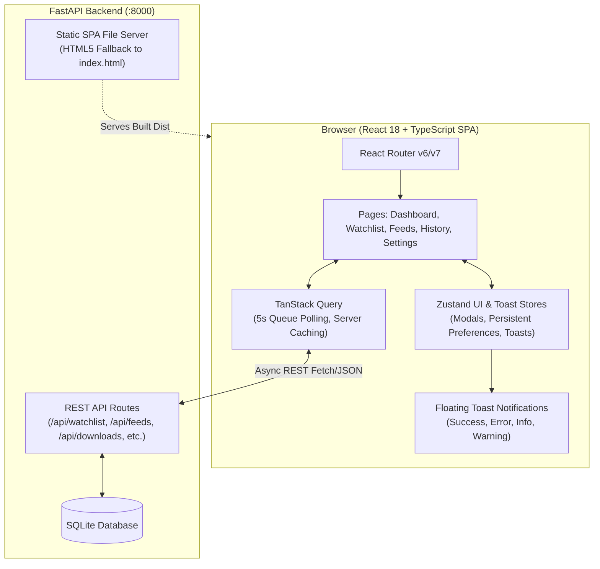

# APKPipe: React & TypeScript SPA Frontend Migration Spec

**Status**: Proposed  
**Date**: 2026-08-23  
**Target Version**: APKPipe 0.2.0  

---

## 1. Executive Summary

APKPipe currently uses server-rendered Jinja2 templates paired with Alpine.js and Tailwind CSS for its web interface. While functional, migrating to a dedicated **React 18 + TypeScript + Vite** Single Page Application (SPA) provides:
- **Strict type safety** end-to-end matching backend Pydantic API schemas.
- **Robust server-state synchronization & polling** via TanStack Query (React Query) for real-time queue monitoring and feed syncs.
- **Lightweight global client state & toast notifications** via Zustand for modal management, persistent preferences, and actionable feedback alerts.
- **Faster developer ergonomics** with instant Vite Hot Module Replacement (HMR) and isolated UI testing.
- **Single-binary / single-container simplicity**: FastAPI serves the compiled React build (`dist/`) directly in production, with zero added runtime containers.

---

## 2. Architecture & Tech Stack



### Technology Matrix
- **Framework & Language**: React 18 / 19, TypeScript 5.x
- **Build Tool**: Vite 6.x
- **Styling & Icons**: Tailwind CSS 3.4+, Lucide React icons
- **Routing**: React Router DOM (v6/v7)
- **Server State & Data Fetching**: TanStack Query (`@tanstack/react-query`)
- **Client State & Preferences**: Zustand (`zustand` with `persist` middleware)
- **Toast Notifications**: Built-in Tailwind-animated Toast system managed by Zustand
- **Backend Serving**: FastAPI `StaticFiles` with HTML5 History API fallback route

---

## 3. Directory Layout

```
/containers/dev/apkpipe/
├── frontend/                     # Standalone Vite + React + TS workspace
│   ├── package.json
│   ├── tsconfig.json
│   ├── tsconfig.node.json
│   ├── vite.config.ts           # Proxy configuration to :8000
│   ├── tailwind.config.js
│   ├── postcss.config.js
│   ├── index.html
│   └── src/
│       ├── api/                 # Strongly typed API client & Query hooks
│       │   ├── types.ts         # TypeScript models matching backend schemas
│       │   ├── client.ts        # Fetch/Axios instance with error handling
│       │   ├── useWatchlist.ts  # CRUD queries and mutations
│       │   ├── useFeeds.ts      # Feed sources & polling mutations
│       │   ├── useDownloads.ts  # Queue queries (5s poll), history, manual trigger
│       │   └── useSettings.ts   # Runtime settings query & update
│       ├── stores/              # Zustand global client stores
│       │   ├── useUIStore.ts    # Modals, sidebar state, persistent preferences
│       │   └── useToastStore.ts # Global toast notification dispatcher
│       ├── components/          # Reusable design system components
│       │   ├── common/
│       │   │   ├── ToastContainer.tsx
│       │   │   ├── Modal.tsx
│       │   │   ├── Badge.tsx
│       │   │   ├── StatCard.tsx
│       │   │   └── ConfirmDialog.tsx
│       │   ├── layout/
│       │   │   ├── Navbar.tsx
│       │   │   ├── Sidebar.tsx
│       │   │   └── Layout.tsx
│       │   └── modals/
│       │       ├── ManualDownloadModal.tsx
│       │       ├── WatchlistModal.tsx
│       │       └── FeedModal.tsx
│       ├── pages/               # Five primary application routes
│       │   ├── Dashboard.tsx    # Live pipeline stats, active queue summary, recent ingests
│       │   ├── Watchlist.tsx    # Monitored apps table, filters, CRUD modals
│       │   ├── Feeds.tsx        # Feed sources, poll triggers, sync status
│       │   ├── History.tsx      # Active queue tab (live 5s poll) & audit history tab
│       │   └── Settings.tsx     # Token management, scraper, OCC command, Apprise/Ntfy
│       ├── App.tsx              # Router & QueryClientProvider setup
│       ├── main.tsx             # DOM entry point
│       └── index.css            # Tailwind directives & glassmorphism theme
├── src/apkpipe/
│   ├── api/                     # Existing FastAPI REST API endpoints
│   ├── web/                     # Serves frontend/dist/ static bundle
│   └── main.py                  # Mounts SPA router with HTML5 fallback
├── Dockerfile                   # Multi-stage: Node 20 builder -> Python runner
└── docker-compose.yaml
```

---

## 4. State Management Architecture

### 4.1 Server State (TanStack Query)
- **Watchlist**: `useWatchlistQuery()` cached with automatic invalidation on add/edit/delete/toggle.
- **Feeds**: `useFeedsQuery()` with manual `pollFeedMutation()` and `pollAllFeedsMutation()`.
- **Live Queue**: `useQueueQuery()` with configurable `refetchInterval` (default: 5000ms, paused when disabled).
- **History**: `useHistoryQuery()` with pagination/filtering.
- **Settings**: `useSettingsQuery()` and `useUpdateSettingsMutation()`.

### 4.2 Client State & Toast Notifications (Zustand)

#### `useToastStore`
```typescript
export interface Toast {
  id: string;
  type: 'success' | 'error' | 'info' | 'warning';
  title: string;
  message?: string;
  duration?: number; // default 4000ms
}

export interface ToastState {
  toasts: Toast[];
  addToast: (toast: Omit<Toast, 'id'>) => void;
  removeToast: (id: string) => void;
}
```

#### `useUIStore`
- **Global Modals**: `manualDownloadModalOpen`, `watchlistModalMode`, `feedModalMode`, etc.
- **Persistent Preferences** (saved to `localStorage`):
  - `autoRefreshQueue: boolean` (default: true)
  - `queuePollingInterval: number` (default: 5000ms)
  - `watchlistFilter: string`
  - `sidebarCollapsed: boolean`

---

## 5. View Specifications

### 5.1 Dashboard (`/`)
- **Quick Metric Cards**: Active Watchlist count, Active Feeds count, Total Ingested count, System Health status.
- **Live Activity Queue**: Real-time card showing in-progress downloads (`resolving`, `downloading`) with live status badges.
- **Recent Ingests**: Most recent 5 completed APKs with file sizes and release tags.
- **Manual Trigger**: Quick-action button in header opening `ManualDownloadModal`.

### 5.2 Watchlist (`/watchlist`)
- **Interactive Search & Filter**: Real-time filtering by app name, package name, category, or enabled/disabled status.
- **Application Table**: Displays App Name, Package Name, Minimum Version (`≥ 8.9.0`), Releaser Whitelists/Blacklists (`+Balatan`, `-Spam`), Status toggle switch, and Actions (Edit, Delete).
- **Add / Edit Modal**: Form validating app name, package name, version constraints, title regex, and comma-separated releasers.

### 5.3 Feeds (`/feeds`)
- **Feed Source Table**: Feed Name, Type (`mobilism_rss`, `generic_rss`, `atom`), URL, Polling Interval, Last Polled Timestamp, Status toggle.
- **Action Triggers**: Single feed "Poll Now" and global "Poll All Feeds Now" with animated spinner indicators and success/error toasts.
- **Add / Edit Feed Modal**: Endpoint URL validation and poll frequency configuration.

### 5.4 Download Queue & History (`/history`)
- **Tabbed Interface**:
  - **Active Queue Tab**: Displays task ID, release title, version, releaser, resolver tier badge (`Real-Debrid`, `JDownloader`, `Direct HTTP`), stage status, file size, retry button (for failed tasks), and cancellation.
  - **Audit History Tab**: Completed downloads with target file paths, file sizes, execution durations, download tiers, and timestamps.
- **Auto-Refresh Controller**: Toggle button to pause or resume 5-second live polling.

### 5.5 Settings (`/settings`)
- **Interactive Forms**:
  - General Pipeline (Application name, poll interval, download dir, staging dir, debug toggle).
  - Real-Debrid Tier 1 Resolver (API token with show/hide password toggle).
  - JDownloader Tier 2 Fallback (Email, password, device name, watch folder).
  - Playwright Scraper & Nextcloud OCC (Scraper URL, Nextcloud URL/token, OCC command).
  - Push Notifications (Apprise URL, Ntfy topic).
- **Save Trigger**: Submits to `POST /api/settings` and fires instant feedback toasts.

---

## 6. Backend Integration & Production Serving

### 6.1 FastAPI Static Asset Serving & HTML5 Fallback
Update [`src/apkpipe/main.py`](file:///containers/dev/apkpipe/src/apkpipe/main.py) to mount the compiled frontend `dist` directory:
- Serves `/assets/*` directly via `StaticFiles`.
- For all non-API paths (e.g. `/watchlist`, `/history`), serves `dist/index.html` allowing React Router to handle client navigation without 404s.

### 6.2 Development Proxying
In [`frontend/vite.config.ts`](file:///containers/dev/apkpipe/frontend/vite.config.ts):
```typescript
export default defineConfig({
  plugins: [react()],
  server: {
    port: 5173,
    proxy: {
      '/api': 'http://localhost:8000',
      '/health': 'http://localhost:8000',
      '/mcp': 'http://localhost:8000',
    },
  },
});
```

### 6.3 Multi-Stage Dockerfile
Update [`Dockerfile`](file:///containers/dev/apkpipe/Dockerfile) with a 3-stage build:
1. **Frontend Builder (`node:20-slim`)**: Runs `npm ci && npm run build` to create `dist/`.
2. **Python Builder (`python:3.12-slim`)**: Installs wheels and backend dependencies.
3. **Runtime (`python:3.12-slim`)**: Copies both the Python virtualenv and the compiled `frontend/dist/` into `/app/frontend/dist/`.

---

## 7. Verification & Testing Strategy

1. **Frontend Type Checking & Build**:
   - `npm run typecheck` (`tsc --noEmit`) passes cleanly with zero errors.
   - `npm run build` generates optimized, minified production assets.
2. **Backend Test Suite Integrity**:
   - Existing 305 pytest tests remain fully passing (≥ 88% coverage).
   - Update [`test_web_ui.py`](file:///containers/dev/apkpipe/tests/test_web_ui.py) to test the SPA static router and fallback routes.
3. **Live End-to-End User Verification**:
   - Verify all 5 views (Dashboard, Watchlist, Feeds, History/Queue, Settings) work seamlessly.
   - Verify 5-second queue polling updates live when a download task runs.
   - Verify toast notifications appear on manual download triggers, watchlist updates, and feed polling.
